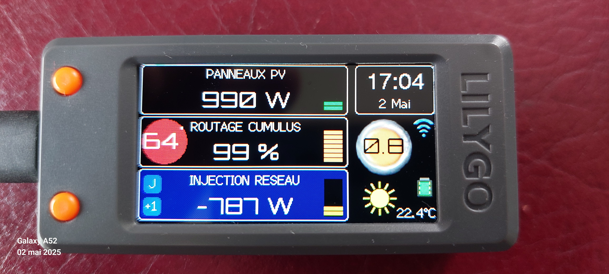

# CompanionIO
Afficheur déporté pour le routeur solaire **MSunPV** de **Ard-Tek**.

 

 

 

**CompanionIO** est un écran déporté qui permet de suivre : 
- la production des panneaux solaires, 
- la consommation de la maison, 
- le routage du surplus de production par le routeur **MSunPV**.

Ainsi que divers informations complementaires très utiles à l'optimisation de l'autoconsomation, dont :
- L'estimation de production previsionnel en fonction de la météo
- La couleur TEMPO 

**CompanionIO** poursuit la voie initiée par **JJHontebeyrie** et **Djeje12** avec leurs versions de Companion pour **MSunPV** et **MaxPV**.

Cette version est une réécriture presque complète du code, et un portage vers l'environnement de développement **VisualC** / **PlatformIO**. 

Elle inclue des fonctionnalités permettant : 
 * l'affichage des mesures du routeur **MSunPV**
   * production des panneaux solaires
   * consommation/injection sur le réseaux électrique
   * taux de routage vers le ballon d'eau chaude
   * température du ballon (si sonde présente)
 * l'affichage du code couleur **Tempo** à J et J+1
 * la méteo et température via **OpenWeatherMap**
 * les prévisions de production solaire à J et J+1 via **Forecast.solar** 
 * la mise en veille et le contrôle de luminosité de l'écran
 * le niveau du signal WiFi
 * la consultation d'une page web locale affichant les mesures du routeur 
 * l'accès local via l'url : http://companion.local (mDNS)
 * l'enregistrement des mesures par **InfluxDB**
 * l'intégration dans **Home Assistant** par **MQTT** et auto configuration (discovery)
 * la configuration en ligne du WiFi, et de tous les paramètres (via AsyncWifiManager)

## Installation

**CompanionIO** est conçu pour être utilisé sur la carte de développement **LILYGO T-Display-S3**, qui est doté d'un afficheur LCD couleur (320x170), et du processeur **ESP32-S3**. 

**LILYGO T-Display S3** 
* info : https://lilygo.cc/products/t-display-s3. 
* achat : https://s.click.aliexpress.com/e/_DBC5gbz

>Si vous n'êtes pas familier des environnements de developpement, vous pouver utiliser l'outil en ligne [EspHome web](https://web.esphome.io/) pour uploader le firmware de CompanionIO sur votre **LILYGO T-Display-S3**.
>
>[EspHome web](https://web.esphome.io/) necessite l'utilisation des navigateurs **Google Chrome** ou **Microsoft Edge**. 

- Raccorder votre **LILYGO T-Display-S3** à votre PC, avec l'aide d'un cable **USB** (permetant l'échange de donnés).
- Télécherger le firmware de CompanionIO
- Rendez vous avec **Google Chrome** sur : [EspHome web](https://web.esphome.io/)
- Mettre le **LILYGO T-Display-S3** en mode 'Upload':
  - Presser le bouton 'Boot' (bouton du haut, si prise usb vers la gauche)
  - Appuyer sur le bouton reset (sur le dessus)
  - Relacher le bouton 'Boot'
- Appuyer sur le bouton 'Connect'
- Sélectionner le port série de raccordement du **LILYGO T-Display-S3**
- Click sur 'Install'
- Choisir le ficher firmware téléchargé précedement
- Click sur 'Install'

Après installation du firmware, le module **LILYGO T-Display-S3** va redémarrer.

Le développement est réalisé sur l'environnement de developpement (IDE) **PlatformIO** / **Visual Studio Code**.

L'affichage de la météo nécéssite une clef API OpenWeatherMap.org gratuite. Pour cela, créez un compte gratuit, puis ensuite créer une clé d'API (https://home.openweathermap.org/api_keys). Puis, utilisez cette clé lors de la configuration du **CompanionIO**.

## Configuration Wifi et parametrage

Le mode de configuration s'activé au démarage si : 
- l'afficheur n'est pas configuré
- ou si le reseau Wifi configuré n'est pas joignable, 
- ou si deux resets sont effectués à moins de 15s d'intervale.

**CompanionIO** active alors un point d'acces Wifi temporaire en mode AP et passe en mode configuration. Un ecran sur fond bleu est alors affiché avec les information nécessaires à la connection :
- point d'acces Wifi : **Companion-IO**
- url de configuration : http://192.168.4.1

Connectez vous à ce point d'accès, à l'aide d'un smartphone, d'une tablette, ou d'un PC, puis dirigez-vous en suite avec un navigateur vers l'url de configuration.

Le menu **Configuration** permet la saisie des identifiants de votre Wifi, ainsi que les autres parametres de l'afficheur **Companion IO**.

Renseignez le nom de votre WiFi et son mot de passe, ainsi que les autres parametres de configuration necessaires au **CompanionIO** (adresse du routeur MSunPV, puissance des paneaux solaire et du cumulus, présence d'une sonde de temperature du cumulus, longitude et latitude de votre installation pour les infos météo, et clé d'API OpenWeather.map).

Apres validation des parametres, le **CompanionIO** effectue un reset et tente de se connecter au WiFi configuré.

 

Si la connexion au WiFi est réussie, l'écran de démarrage affiche l'adresse IP du **CompanionIO** attribuée par votre box pendant quelques secondes. 

Celui-ci peut maintenant être joint à cette adresse depuis votre réseau local, ou avec l'url http://companion.local

 

Pour plus de simplicité. Pencez à associer une adresse IP fixe au **CompanionIO**, via l'interface d'administration de votre box.

---
## Utilisation de l'afficheur

Cette version permer l'affichage de :
* La production photovoltaiques instantanée
* L'énergie routée vers le cumulus
* La consommation electrique du domicile
* la quantité d'énergie exportée
* Les informations météo locales
* L'heure et la date locale (synchronisée sur Internet)
* L'heure du lever et du coucher de soleil

Le rafraichissement des données photovoltaiques se fait toutes les 15 secondes. La météo est quand à elle actualisée toutes les 15 minutes.

Le bouton du T-Diplay situé en bas (si vous avez branché le module par la gauche), permet de sélectionner en séquence l'écran affiché : 
  - Affichage principal, 
  - Prévision de production (courbes heure/heure J et J+1), 
  - Tempo, 
  - Compteurs de cumuls, 
  - Réglage luninosité.
  - Météo (en developpement)

Un double clic sur ce bouton revient à l'écran principal. 

Le bouton du T-Diplay situé en haut permet d'allumer ou éteindre l'écran. Celui-ci s'éteindra également au bout de 5 mn si vous avez choisi le mode veille lors de la configuration. 

Sur l'écran de réglage de luminosité écran, un clic simple sur ce bouton augmente la luminosité, alors qu'un double clic la diminue.

En cas de problème, le bouton reset situé sur le dessus du boitier permet de relancer le programme. Un double reset en moins de 15s permet d'activer le mode de configuration (Wifi AP).

## Intégration avec InfluDB

**InfluxDB** est un système de gestion de base de données orientée séries temporelles, employées notamment pour stocker et analyser des données horodatées de capteurs. **InfluxDB** est courament utilisé pour le monitoring de processus, la surveillance d'infracstructure, ou de performance.

**CompanionIO** peut transmettre périodiquement les mesures du routeur vers une instance **InfluxDB** pour mémorisation, et permettre une analyse graphique en temps réel ou à postérieri.

 

La transmission des messures routeur vers **InfluxDB** est activable dans l'écran de configuration du WIFI et des autes paramètres.

## Intégration avec Home Assistant

**CompanionIO** peut servir d'interface entre **MSunPV** et **Home Assistant**, en transmettant périodiquement les données du routeur sous forme d'evenement **MQTT**.

Cette solution bien que toujours opérationnelle, et maintenant surpassée par l'intégration native [MSunPVIntegration](https://github.com/pvergezac/MSunPVIntegration) disponible dans **Home Assistant** avec **HACS**.

 

La transmission des messures du routeur via **MQTT** est activable dans l'écran de configuration du WIFI et des autes paramètres.

---
## Utilisation avec l'IDE PlateformIO

* Installer **PlatformIO** (voir : https://platformio.org/platformio-ide) 
  * Download and install official Microsoft's Visual Studio Code
  * Open **VSCode** Extension Manager
  * Search for official **PlatformIO IDE** extension
  * Install **PlatformIO IDE**
* Cloner le dépots du projet, dans le répertoire de travail
  ou télécharger le zip des sources du projet, et le déziper dans le répertoire de travail.

    Lors du premier upload du logiciel sur le module **T-Display-S3**, il et nécessaire d'uploader les fichiers de donnée du repertoire **'data'**. Pour cela utiliser le commande **Upload Filesystem Image** de **PlateformIO**. Par la suite la commande **Upload** suffira à télécharger le code, et n'effacera pas la sauvegarde des paramatres de configuration (contrairement à la première).

---
## MSunPV
 

Le routeur **MSunPV** de **Ard-Tek** est un routeur solaire permettant d'utiliser l'éxèdent de production des panneaux solaires pour recharger le ballon d'eau chaude, au lieu de l'injecter sur le réseau électrique.

Il fonctionne à la maniere d'un variateur de puissance (gradateur), en adaptant la puissance du ballon d'eau chaude en fonction du surplus de production solaire vis à vis de la consomation du domicile. Il utilise pour cela un ou plusieur capteurs de courant placés sur les cables du tableau électrique. 

Tous les détails sont sur le site de [Ard-Tek](https://ard-tek.com).

---
## Crédits

L'afficheur est basé sur les travaux du **[Companion MSunPV de @jjhontebeyrie](https://github.com/JJHontebeyrie/Companion)**, mais également sur ceux du **[Companion pour MaxPV de @djeje12](https://github.com/djeje12/Companion_for_MaxPV)**.

Le code en a été très largement ré-écrit et adpaté.

Il y a de nombreux échanges sur le développement et l'utilisation de ces afficheurs sur le [Forum Photovoltaique](https://forum-photovoltaique.fr/viewtopic.php?t=62730), mais également sur le [forum de Ard-Tek](https://ard-tek.com/index.php/forum/vos-installations-mspv/686-faire-un-afficheur-deporte).

