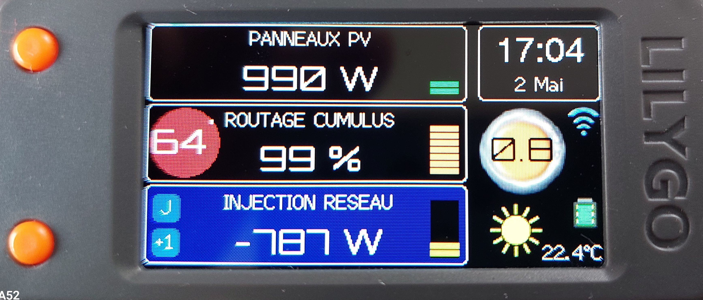
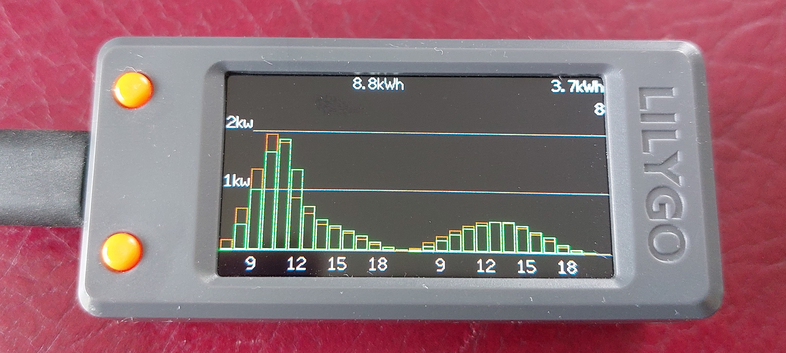
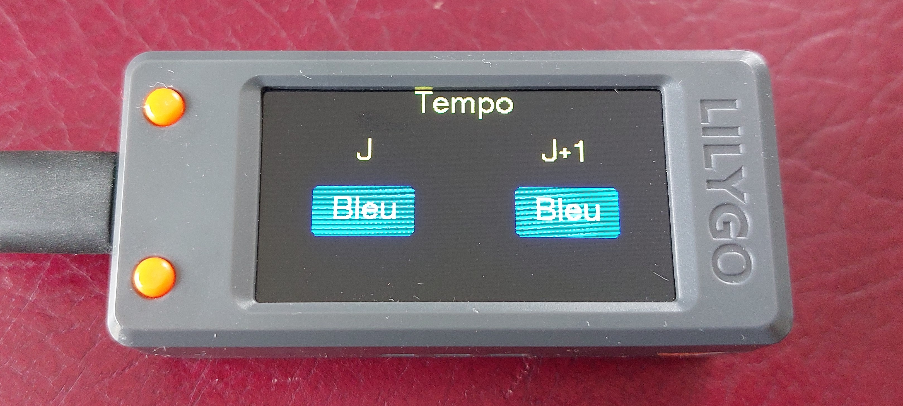
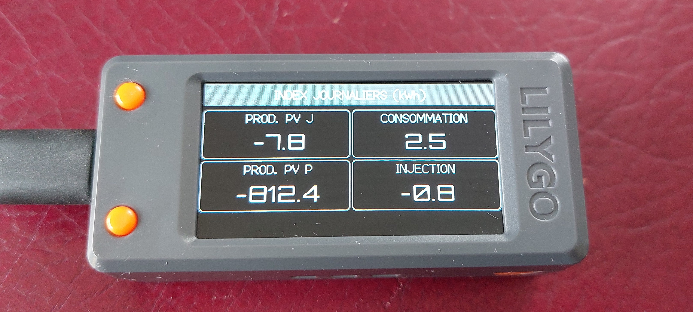
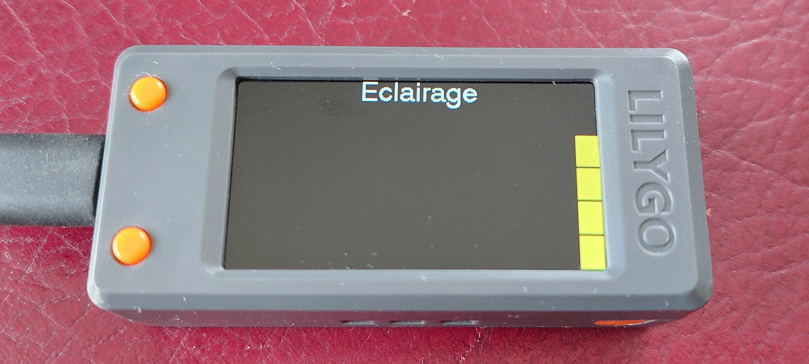
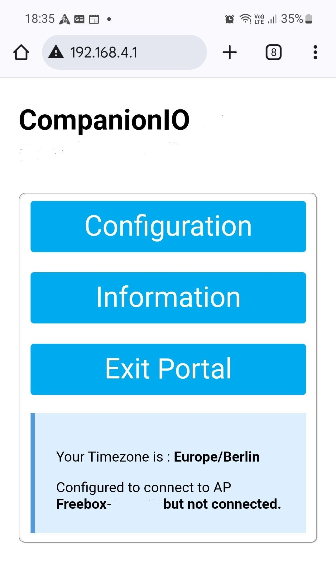
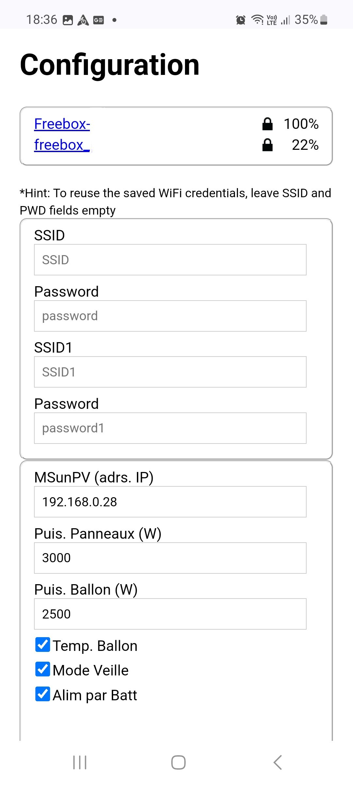
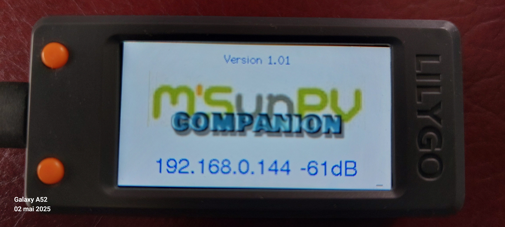
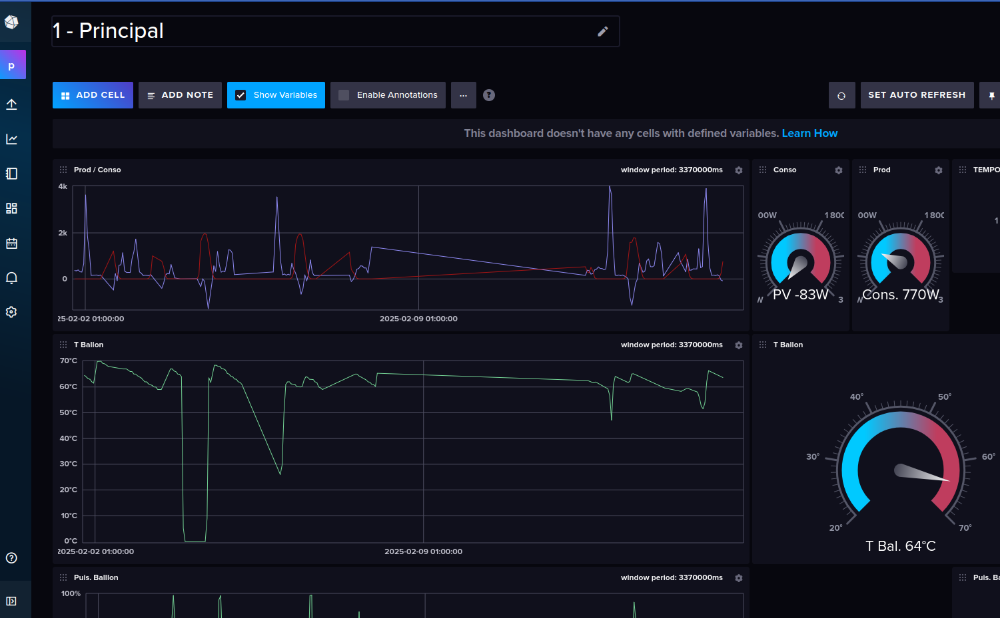
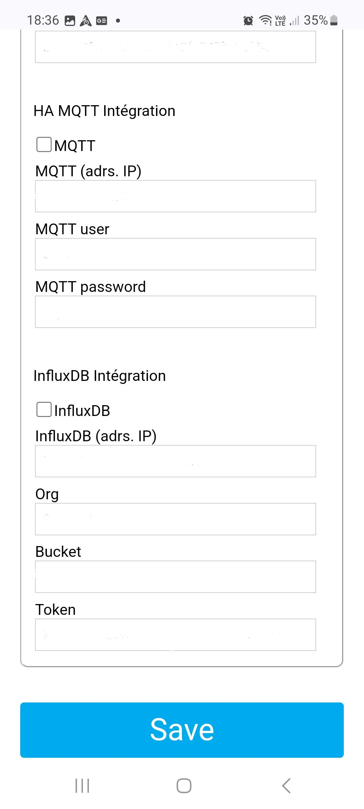

# CompanionIO

 

 

 

**CompanionIO** est un écran déporté pour le **routeur solaire MSunPV** de [**Ard-Tek**](https://ard-tek.com/), permettant de suivre : 
- la production des panneaux solaires, 
- la consommation de la maison sur le réseau, 
- le routage du surplus de production vers le ballon d'eau chaude.

Ainsi que diverses informations, utiles à l'optimisation de l'autoconsommation :
- Météo locale courante
- Estimation prévisionnelle de la production solaire (J et J+1)
- Couleur du jour TEMPO (J et J+1)

 

Ce projet poursuit la voie initiée par **JJHontebeyrie** et **Djeje12** avec leurs versions d'afficheurs pour **MSunPV** et **MaxPV**.

Une importante réécriture du code a été réalisée, ainsi qu'un portage vers l'environnement de développement **VS Code / PlatformIO**. 

---
## Fonctionnalités

**CompanionIO** inclue des fonctionnalités : 
 * Affichage des mesures du routeur **MSunPV**
   * Production des panneaux solaires
   * Consommation/injection sur le réseaux électrique
   * Taux de routage vers le ballon d'eau chaude
   * Température du ballon (si sonde présente)
 * Code couleur du jour **Tempo** (J et J+1)
 * Météo et température courante, via **OpenWeatherMap**
 * Prévisions de production solaire (J et J+1), via **Forecast.solar** 
 * Mise en veille et contrôle de luminosité de affichage
 * Niveau du signal WiFi
 * Accès web locale aux mesures du routeur
   * http://companion.local (mDNS)
 * Intégration avec **InfluxDB** (option), historisation des mesures
 * Intégration avec **Home Assistant** (option), via **MQTT** et auto discovery
> * **Installation en ligne** du firmware, **sans environnement de développement** 
>* **Mise à jour en ligne** du firmware par OTG
>* **Configuration en ligne** du WiFi, et des paramètres (via AsyncWifiManager)

---
## Matériel

**CompanionIO** est conçu pour la carte de développement **LILYGO T-Display-S3**, qui comporte un **afficheur OLED 320x170**, et un processeur **ESP32-S3**

>**Description sur : [Lilygo.cc](https://lilygo.cc/products/t-display-s3)**
  - Achat sur : [Aliexpress.com](https://s.click.aliexpress.com/e/_DBC5gbz)
  - Ou sur : [Amazon.fr](https://amazon.fr) 
      - Chercher : "lilygo t-display-s3"

---
## Installation

>**Si vous n'êtes pas familier des environnements de développement, vous pouvez installer le firmware de CompanionIO avec l'outil en ligne [Esp Tool](https://espressif.github.io/esptool-js/), depuis un navigateur Google Chrome ou Microsoft Edge**. 

Pour cela : 
- Télécharger le **firmware CompanionIO** depuis Github : [merged-firmware.bin](https://github.com/pvergezac/CompanionIO/raw/refs/heads/main/merged-firmware.bin)
- Raccorder **LILYGO T-Display-S3** à votre PC, via un cable **USB** (alimentation + donnés).
- Rendez-vous avec **Google Chrome** ou **Microsoft Edge** sur : [Esp Tool](https://espressif.github.io/esptool-js/)
- Mettre le module **LILYGO T-Display-S3** en mode **Upload**:
  - Maintenir le bouton 'Boot' pressé (bouton du haut, si prise usb vers la gauche)
  - Faire un reset (bouton sur le dessus)
  - Relacher le bouton 'Boot'
- Dans la section "Program" 
  - Sélectionner "Baudrate" sur : 230400
  - Click sur le bouton **"Connect"**
  - Sélectionner le port série de raccordements du **LILYGO T-Display-S3**
  - Puis **"Connexion"**
  - mettre "Flash address" à : **0x0**
  - puis choisir le ficher **"merged-firmware.bin"** (téléchargé précédemment)
- Click sur **"Program"**

> **Le upload et l'installation du firmware ne dure que quelques secondes. Après installation du firmware, le module LILYGO T-Display-S3 va redémarrer.**
> 
> **Si ce n'est pas le cas, faire un reset.**

---
## Configuration Wifi et paramétrage

> **L'affichage de la météo nécessite une clef API "OpenWeatherMap.org" gratuite.**
> 
> **Vous devez donc vous la procurer pour pouvoir compléter la configuration de CompanionIO.** 
> - **Aller sur : https://home.openweathermap.org/api_keys**
>   - **Créez un compte**
>   - **Créer une clé d'API (à utiliser lors de la configuration de CompanionIO)**

Au démarrage, si le Wifi n'est pas configuré, ou s'il n'est pas joignable, **CompanionIO** passe en mode configuration et active un point d'accès Wifi AP nommé **"Companion-IO"**.

- Un écran sur fond bleu affiche alors, les informations nécessaires à la connexion pour réaliser la configuration :
  - Point d'accès : **"Companion-IO"**
  - Url de configuration : http://192.168.4.1

>**Le mode configuration peut également être activé en réalisant 2 reset successifs en moins de 15 secondes.**

- Avec Smartphone, une tablette ou un PC :
  - Connectez-vous au point d'accès Wifi : **"Companion-IO"**
  - Puis avec un navigateur, sur l'url de configuration : http://192.168.4.1

  

- Le menu **Configuration** permet la saisie des identifiants de votre Wifi, ainsi que les autres paramètres de l'afficheur **Companion IO**.

   

- Renseigner les paramètres Wifi Renseigner
  - Sélectionner votre Wifi, en haut dans la liste des Wifis détectés
  - Renseigner son mot de passe
- Renseigner les autres paramètres de configuration :
  - Adresse IP du routeur MSunPV
  - Puissance des panneaux solaire et du cumulus
  - Présence d'une sonde de température du cumulus
  - Mise en veille
  - Longitude et latitude de votre installation pour les infos météo
  - Clé d'API OpenWeather.map

> Après validation des paramètres, **CompanionIO** effectue un reset et tente de se connecter au Wifi configuré.

   

> Si la connexion au Wifi est réussie. L'écran de démarrage s'affiche quelques secondes, avec :
> - La version du firmware
> - L'adresse IP du **CompanionIO**

> **CompanionIO** peut être joint à cette adresse IP (ou http://companion.local) depuis votre réseau local.

   

> **Vous pouvez associer une adresse IP fixe au CompanionIO (via l'interface d'administration de votre box), pour garantir quelle ne change pas.**

---
---
## Utilisation de l'afficheur CompanionIO

Cette version permet l'affichage de :
* La production photovoltaïque instantanée
* L'énergie routée vers le cumulus
* La consommation électrique du domicile
* la quantité d'énergie exportée
* Les informations météo locales
* L'heure et la date locale (synchronisée sur Internet)
* L'heure de lever et de coucher du soleil

>Le rafraichissement des données photovoltaïques se fait toutes les 15 secondes. La météo est quant à elle actualisée toutes les 15 minutes.

Le **bouton du bas** (si prise Usb gauche), permet de sélectionner en séquence l'écran affiché : 
  - Affichage principal, 
  - Prévision de production (courbe heure par heure, J et J+1), 
  - Couleur Jours Tempo, 
  - Compteurs de cumuls, 
  - Réglage luminosité.
  - Météo détaillée (en développement)

Un **double clic** sur ce **bouton du bas** revient à l'écran principal. 

Le **bouton du haut** permet d'allumer ou éteindre l'écran. Celui-ci s'éteindra également après 5 mn si le mode veille est validé lors de la configuration. 

Sur l'écran de **réglage de luminosité**, un **clic simple** sur le **bouton du haut** augmente la luminosité, alors qu'un **double clic** la diminue.

>En cas de problème, le **bouton reset** situé sur le dessus du boitier permet de relancer le programme.

>Un **double reset** en moins de 15 s permet d'activer le mode de configuration (Wifi AP).

## Intégration avec InfluDB

**InfluxDB** est un système de gestion de base de données orientée séries temporelles. Il est employé notamment pour stocker et analyser des données horodatées de capteurs.

**InfluxDB** est couramment utilisé pour le monitoring de processus, la surveillance d'infrastructure, ou de performance.

**CompanionIO** peut transmettre périodiquement les mesures du routeur vers une instance **InfluxDB** pour mémorisation, et permettre une analyse graphique en temps réel ou à postériori.

  

La transmission des mesures vers **InfluxDB** est activable dans l'écran de configuration du WIFI et des autres paramètres.

## Intégration avec Home Assistant

**CompanionIO** peut servir d'interface entre **MSunPV** et **Home Assistant**, en transmettant périodiquement les données du routeur sous forme d'événement **MQTT**.

> **Cette solution bien que toujours opérationnelle, et maintenant surpassée par l'intégration native [MSunPVIntegration](https://github.com/pvergezac/MSunPVIntegration) disponible dans HACS**.

  

> L'activation de la transmission des mesures du routeur via **MQTT** est réalisée dans l'écran de configuration du WIFI.

---
---
## Utilisation avec l'IDE PlateformIO

* Installer **PlatformIO** (voir : https://platformio.org/platformio-ide) 
  * Download and install official Microsoft's Visual Studio Code
  * Open **VSCode** Extension Manager
  * Search for official **PlatformIO IDE** extension
  * Install **PlatformIO IDE**
* Cloner le dépôt du projet, dans le répertoire de travail
  ou télécharger le zip des sources du projet, et le dézipper dans le répertoire de travail.

    Lors du premier upload du logiciel sur le module **T-Display-S3**, il et nécessaire d'uploader les fichiers de donnée du repertoire **'data'**. Pour cela utiliser le commande **Upload Filesystem Image** de **PlateformIO**. Par la suite la commande **Upload** suffira à télécharger le code, et n'effacera pas la sauvegarde des paramatres de configuration (contrairement à la première).

---
---

## Routeur MSunPV

  

Le routeur **MSunPV** de **Ard-Tek** est un routeur solaire permettant d'utiliser l'excédent de production des panneaux solaires pour recharger le ballon d'eau chaude, au lieu de l'injecter sur le réseau électrique.

> **Il fonctionne à la manière d'un variateur de puissance (gradateur), en adaptant la puissance du ballon en fonction du surplus de production solaire (production - consommation du domicile).**

- Il utilise pour cela un ou plusieurs capteurs de courant placés sur les câbles du tableau électrique.
- Il peut également mesurer la température du ballon, si une sonde y est ajoutée.
- Il remplace le commutateur jour/nuit, pour bénéficier de l'ensoleillement et compléter éventuellement la chauffe en horaire de nuit si nécessaire.

Tous les détails sont sur le site de [Ard-Tek](https://ard-tek.com).

---
---
## Crédits

L'afficheur est basé sur les travaux du **[Companion MSunPV de @jjhontebeyrie](https://github.com/JJHontebeyrie/Companion)**, mais également sur ceux du **[Companion pour MaxPV de @djeje12](https://github.com/djeje12/Companion_for_MaxPV)**.

Le code en a été très largement réécrit et adapté.

Il y a de nombreux échanges sur le développement et l'utilisation de ces afficheurs sur le [Forum Photovoltaïque](https://forum-photovoltaique.fr/viewtopic.php?t=62730) et le [Forum Ard-Tek](https://ard-tek.com/index.php/forum/vos-installations-mspv/686-faire-un-afficheur-deporte).

