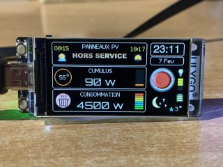
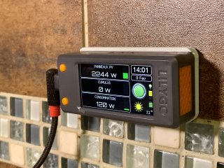
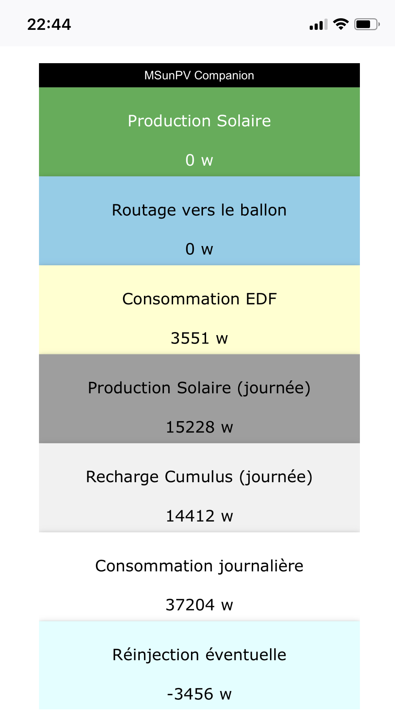

# CompanionIO
Afficheur déporté pour le routeur solaire **MSunPV** de **Ard-Tek**.

   
 

 

**CompanionIO** est un écran déporté qui permet de suivre : 
- la production des panneaux solaires, 
- la consommation de la maison, 
- le routage du surplus de production par le routeur **MSunPV**.

Ainsi que divers informations complementaires très utiles à l'optimisation de l'autoconsomation, dont :
- L'estimation de production previsionnel en fonction de la météo
- La couleur TEMPO 

**CompanionIO** poursuit la voie initiée par **JJHontebeyrie** et **Djeje12** avec leurs versions de Companion pour **MSunPV** et **MaxPV**.

Cette version est une réécriture presque complète du code, et un portage vers l'environnement de développement **VisualC** / **PlatformIO**. 

Elle inclue des fonctionnalités permettant : 
 * l'affichage des mesures du routeur **MSunPV**
   * production des panneaux solaires
   * consommation/injection sur le réseaux électrique
   * taux de routage vers le ballon d'eau chaude
   * température du ballon (si sonde présente)
 * l'affichage du code couleur **Tempo** à J et J+1
 * la méteo et température via **OpenWeatherMap**
 * les prévisions de production solaire à J et J+1 via **Forecast.solar** 
 * la mise en veille et le contrôle de luminosité de l'écran
 * le niveau du signal WiFi
 * la consultation d'une page web locale affichant les mesures du routeur 
 * l'accès local via l'url : http://companion.local (mDNS)
 * l'enregistrement des mesures par **InfluxDB**
 * l'intégration dans **Home Assistant** par **MQTT** et auto configuration (discovery)
 * la configuration en ligne du WiFi, et de tous les paramètres (via AsyncWifiManager)

## Pré-requis

**CompanionIO** est conçu pour être utilisé sur la carte de développement **LILYGO T-Display-S3**, qui est doté d'un afficheur LCD couleur (320x170), et du processeur **ESP32-S3**. 

**LILYGO T-Display S3** 
* info : https://lilygo.cc/products/t-display-s3. 
* achat : https://s.click.aliexpress.com/e/_DBC5gbz

Le développement est réalisé sur l'environnement de developpement (IDE) **PlatformIO** / **Visual Studio Code**.

L'affichage de la météo nécéssite une clef API OpenWeatherMap.org gratuite. Pour cela, créez un compte gratuit, puis ensuite créer une clé d'API (https://home.openweathermap.org/api_keys). Puis, utilisez cette clé lors de la configuration du **CompanionIO**.

## Configuration Wifi et parametrage

Le mode de configuration s'activé au démarage si : 
- le reseau Wifi configurer n'est pas joignable, 
- ou si deux resets sont effectués à moins de 10s d'intervale.
  
L'écran de l'afficheur, indique alors le nom du Wifi **Companion-IO** et l'adresse http://192.168.4.1 à laquelle vous devez vous connecter avec un smartphone, une tablette, ou un PC.

Renseigner en suite le nom de votre WiFi et son mot de passe, ainsi que les autre parametres de configuration propre au Companion (adresse du routeur MSunPV, puissance des paneaux solaire et du cumulus, presence ou non d'une sonde de temperature du cumulus, longitude et latitude de votre maison pour les infos météo, et clé d'API OpenWeather.map).

Apres validation des parametres, le CompanionIO effectue un reset et tente de se connecter au WiFi configuré.

Si la connexion au WiFi est réussie, l'écran de démarrage affiche l'adresse IP du CompanionIO pendant quelques secondes. Celui si peut alors être joint à cette adresse depuis votre réseau local, ou avec l'url http://companion.local

Si **CompanionIO** n'est pas configuré, ou après un double reset à moins de 15s d'intervale, l'afficheur active un point d'acces Wifi AP nommé **Companion-IO** et passe en mode configuration. 
Un ecran sur fond bleu est alors affiché avec les information nécessaires à la connection.
Connectez vous à ce point d'accès temporaire, à l'aide d'un smartphone, une tablette, ou un PC.
Dirigez-vous en suite avec un navigateur web vers : http://192.168.4.1. 
Le menu **Configuration** permet la saisie des identifiants de votre Wifi, ainsi que les autres parametres de l'afficheur **Companion IO**.

---
## Utilisation de l'afficheur

Cette version permer l'affichage de :
* La production photovoltaiques instantanée
* L'énergie routée vers le cumulus
* La consommation electrique du domicile
* la quantité d'énergie exportée
* Les informations météo locales
* L'heure et la date locale (synchronisée sur Internet)
* L'heure du lever et du coucher de soleil

 

Le rafraichissement des données photovoltaiques se fait toutes les 15 secondes. La météo est quand à elle actualisée toutes les 15 minutes.

Le bouton du T-Diplay situé en bas (si vous avez branché le module par la gauche), permet de sélectionner en séquence l'écran affiché : 
  Affichage principal, Météo, Prévision de production, Tempo, Cumuls, Réglage luninosité.

Le bouton du T-Diplay situé en haut permet d'allumer ou éteindre l'écran. Celui-ci s'éteindra également au bout de 2mn si vous avez choisi le mode veille lors de la configuration. Sur l'écran de réglage de la luminosité de l'écran, un simple clic sur ce bouton augmente la luminosité, alors qu'un double clic la diminue.

En cas de problème, le bouton reset situé sur le haut du boitier permet de relancer le programme. Un double reset en moins de 15s permet d'activer le mode de configuration (Wifi AP).

## Intégration avec InfluDB

TODO Description

InfluxDB est un système de gestion de base de données orientée séries temporelles, employées notamment pour stocker et analyser des données de capteurs horodatées. Il est courament utilisé pour le monitorer des processus, la surveillance d'infracstructures ou de performance.

Cette fonctioonnalité ajoute la possibilité d'enregister les mesures du MSunPV pour une analyse graphique en temps réel ou à postérieri.

[image]

## Intégration avec Home Assistant

TODO Description

## Utilisation avec l'IDE PlateformIO

* Installer PlatformIO (voir : https://platformio.org/platformio-ide) 
  * Download and install official Microsoft's Visual Studio Code
  * Open VSCode Extension Manager
  * Search for official PlatformIO IDE extension
  * Install PlatformIO IDE
* Cloner le dépots du projet, dans le répertoire de travail
  ou télécharger le zip des sources du projet, et le déziper dans le répertoire de travail 

---
## MSunPV

Le routeur **MSunPV** de **Ard-Tek** est un routeur solaire permettant d'utiliser l'éxèdent de production des panneaux solaires pour recharger le ballon d'eau chaude, au lieu de l'injecter sur le réseau électrique.
Il fonctionne à la maniere d'un variateur de puissance (gradateur), en adaptant la puissance du ballon d'eau chaude en fonction du surplus de production solaire vis à vis de la consomation du domicile. Il utilise pour cela un ou plusieur capteurs de courant placés sur les cables du tableau électrique. 

Tous les détails sont sur le site de [Ard-Tek](https://ard-tek.com).

---
## Crédits

L'afficheur est basé sur les travaux du [**Companion MSunPV** de @jjhontebeyrie](https://github.com/JJHontebeyrie/Companion), mais egalement ceux du [**Companion pour MaxPV** de @djeje12](https://github.com/djeje12/Companion_for_MaxPV).

Le code a par contre été très largement ré-écrit et adpaté.

De nombreux échanges sur le développement et l'utilisation de ces routeurs sont présent sur le [Forum Photovoltaique](https://forum-photovoltaique.fr/viewtopic.php?t=62730).

